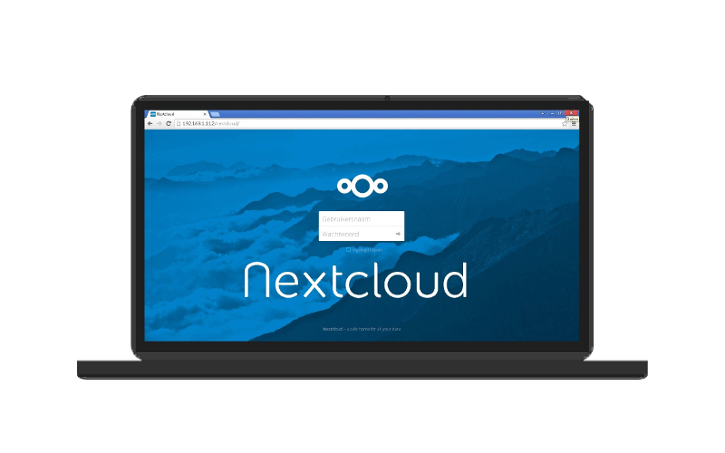

So you want to install your own dropbox like cloud storage service? Well you’ve made the right choice with nextcloud! Its relatively easy to install and maintain and has a vibrant community and full app store of its own!
<!---excerpt--->
So without further adieu, lets begin!

First and foremost, we must install dependencies.


apt-get install apache2 mariadb-server libapache2-mod-php7.0
apt-get install php7.0-gd php7.0-json php7.0-mysql php7.0-curl php7.0-mbstring
apt-get install php7.0-intl php7.0-mcrypt php-imagick php7.0-xml php7.0-zip


Next we’ll download newest version of nextcloud. As of writing it was 13.0.0, but if you’re looking at this page a few months or even years from publication, then just check their [website](https://nextcloud.com/install/) for the newest link and replace it after wget here:


cd /opt
sudo wget https://download.nextcloud.com/server/releases/nextcloud-13.0.0.tar.bz2

tar -xjf nextcloud-x.y.z.tar.bz2

cp -r nextcloud /var/www/html


Now we’ve download nextcloud and extracted it to our apache web root directory. Next we’ll create a database and user for nextcloud to use in the mariadb we downloaded in the dependency step above.


mysql -uroot -p

CREATE USER 'nextcloud'@'localhost' IDENTIFIED BY 'p4ssw0rd';
CREATE DATABASE IF NOT EXISTS nextcloud;
GRANT ALL PRIVILEGES ON nextcloud.* TO 'nextcloud'@'localhost' IDENTIFIED BY 'p4ssw0rd';


And we must create data directory where nextcloud will store its file. It will suggest a “Data” subdirectory in its own directory, but that means it will also be in the apache web root directory and possibly accessible to the web. So for securitys sake I like to make a new folder in /opt/… as such:


sudo mkdir /opt/nextclouddata


Next we’ll ensure permissions are good everywhere so apache can read and write all necessary directories/files.


sudo chown -R www-data:www-data /opt/nextclouddata
sudo chown -R www-data:www-data /var/www/html/nextcloud


Next we need to make a new apache virtual host file. The legit way to do this is to create it in /etc/apache2/sites-available and then a2ensite it to create a symlink in sites-enabled. But the lazy way which also works just fine is the way we’re going to do it here, and thats to simply make the file directly in:

sudo nano /etc/apache2/sites-enabled/nextcloud.conf


Alias /nextcloud "/var/www/nextcloud/"
Options +FollowSymlinks
AllowOverride All
Dav off

SetEnv HOME /var/www/nextcloud
SetEnv HTTP_HOME /var/www/nextcloud


Next we’ll enable all the necessary apache modules:


a2enmod rewrite
a2enmod headers
a2enmod env
a2enmod dir
a2enmod mime


If your going to be running it over ssl (https) then add:


a2enmod ssl
a2ensite default-ssl


After allll of that is finished, we can finally restart apache for all of our changes above to take affect.


sudo systemctl restart apache2


Now you can go to http://www.yourdomain.com/nextcloud and fill out initial setup!


Admin User:
Username: [youruser]
Password: [yourpassword]

Data Dir: /opt/nextclouddata

DB User: nextcloud
DB PW: p4ssw0rd
DB: nextcloud
Server: localhost:3306


After you fill in those details, click on “Finish” at the bottom of the page and give it a few minutes to setup!

Once it is completed you’ll be greeted with the welcome screen where you can download local sync clients for every platform imaginable.

We’re not entirely done yet though!

After install there are a few more settings which need to be tweaked.

If your going to change the background jobs to cron (which I recommend) then you have to add the following cronjob under the www-data user:


#crontab -u www-data -e
*/15  *  *  *  * php -f /var/www/nextcloud/cron.php


In the top right, click on the user icon and hit settings. Then go to “basic settings” under “Administration” in the left menu and set background jobs to cron

Next we’ll want to tweak the php settings to increase performance of the whole thing. In your php.ini, usually located around /etc/php/[version #]/apache2/php.ini

Set the following:


upload_max_filesize = XXX MB
post_max_size = XXX MB
opcache.enable=1
opcache.enable_cli=1
opcache.interned_strings_buffer=8
opcache.max_accelerated_files=10000
opcache.memory_consumption=128
opcache.save_comments=1
opcache.revalidate_freq=1


Finally, if you want to enable “Pretty URLs” – which just removes the /index.php part so that http://www.domain.com/nextcloud/index.php?file=32hijsnf3 turns into http://www.domain.com/nextcloud/j32h3ruih which does look much nicer in my opinion..

We have to edit the nextcloud config file as such and run nextclouds .htaccess update script:


sudo nano /var/www/html/nextcloud/config/config.php
'overwrite.cli.url' => 'https://cloud.iamnico.xyz',
'htaccess.RewriteBase' => '/',

sudo -u www-data php /var/www/nextcloud/occ maintenance:update:htaccess


And don’t forget to set AllowOverride All in your nextcloud virtualhost file.

After all of that, another apache restart doesn’t hurt..

sudo systemctl restart apache2

And finally we are more or less finished. You can flip through the settings and change the theme colors or add some apps (theres a huge selection!), but the basics were hopefully all covered here and you’ve got your own nextcloud system up and running now! If you ran into trouble anywhere, remember RTFM and Google is your friend!
